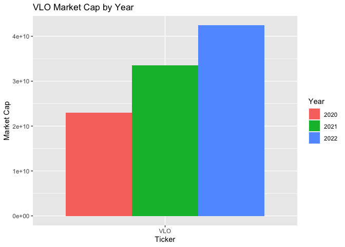
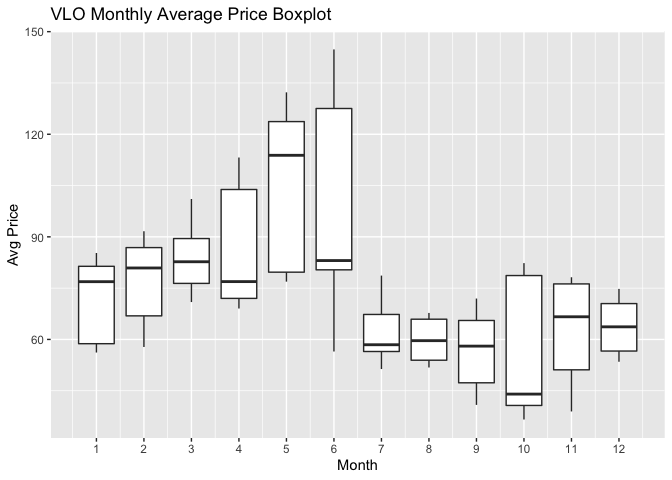
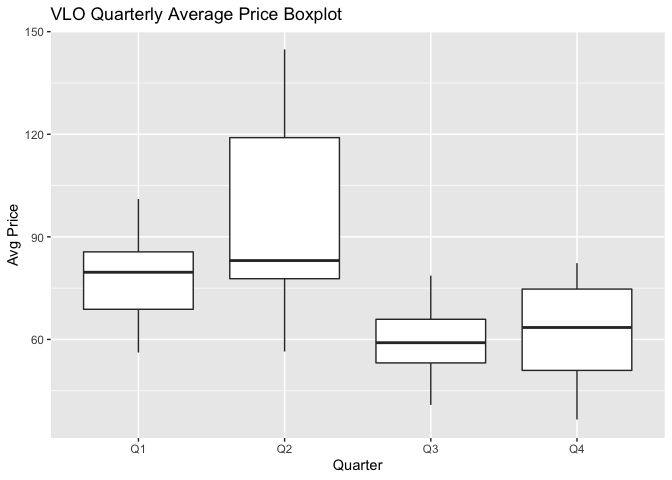
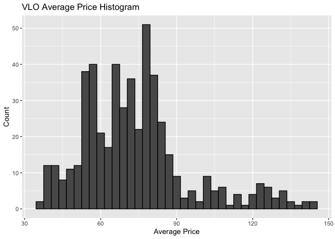
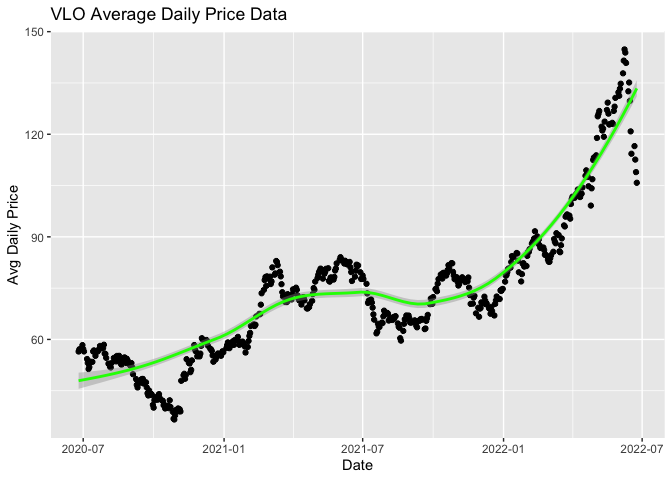
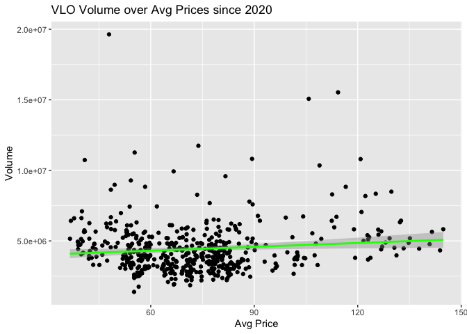
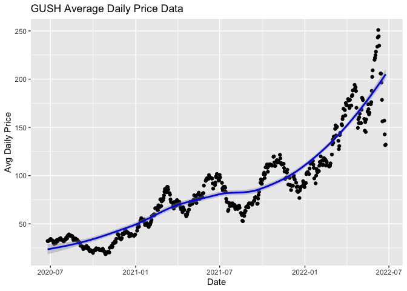
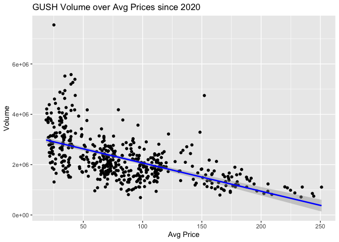
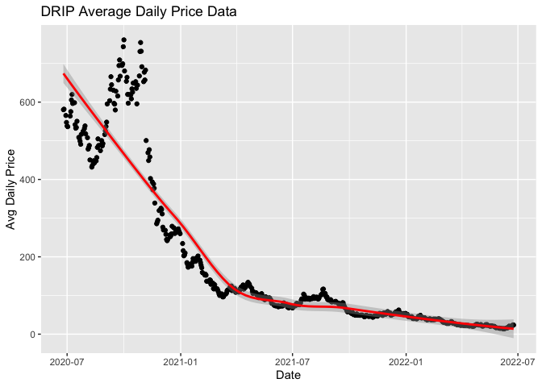
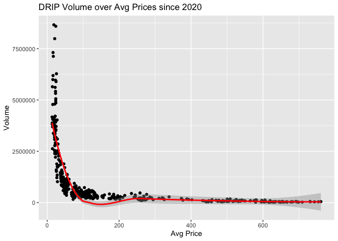

Using APIs: Creating Vignette on Oil Industry Stock Data as Example
================
Evan Brown
2022-06-23

-   [**Required Functions**](#required-functions)
-   [**Functions for API Interaction**](#functions-for-api-interaction)
    -   [‘marketcap’ Function](#marketcap-function)
    -   [‘dailyaggregate’ function](#dailyaggregate-function)
-   [**Data Exploration**](#data-exploration)
-   [**Conclusions**](#conclusions)

This is a vignette to show how to retrieve data from an
[API](https://aws.amazon.com/what-is/api/#:~:text=API%20stands%20for%20Application%20Programming,other%20using%20requests%20and%20responses.).
To demonstrate, I’ll be working with the [Polygon Financial
API](https://polygon.io/docs/stocks/getting-started). For the purposes
of this work, I used a free account with Polygon, limiting my data
retrieval “from-date” to 2 years. Due to this limitation, I will keep
all function calls limited to 2 years from the completion date of this
project (2020-06-25 - 2022-06-25). Users of the functions after this
date with an apikey corresponding to a free account will need to pass
more recent dates.

In this vignette, I will pull data from the [S&P Oil & Gas Exploration &
Production Industry
Index](https://www.spglobal.com/spdji/en/indices/equity/sp-oil-gas-exploration-production-select-industry-index/#data)
and explore endpoints about a top industry constituent, [Valero Energy
Corporation](https://finance.yahoo.com/quote/VLO/) along with some brief
comparisons to 2 popular
[ETF’s](https://www.investopedia.com/terms/e/etf.asp#:~:text=An%20exchange%2Dtraded%20fund%20(ETF)%20is%20a%20type%20of,that%20a%20regular%20stock%20can.)
and make some conclusions about what I find.

# **Required Functions**

These R packages are required in order to work with the Polygon API:

-   [tidyverse](https://www.tidyverse.org/packages/)  
-   [jsonlite](https://cran.r-project.org/web/packages/jsonlite/index.html)
-   [httr](https://cran.r-project.org/web/packages/httr/vignettes/quickstart.html)

# **Functions for API Interaction**

This portion of the vignette will show where I define functions for
interacting with the Polygon Financial API.

## ‘marketcap’ Function

This function returns the [market
cap](https://www.investopedia.com/terms/m/marketcapitalization.asp) for
the user provided ticker and date. apikey default is my key, but users
of the function should pass their own key in the function call options.
User keys can be generated [here](https://polygon.io/).

``` r
#Create marketcap function
marketcap <- function(ticker, date, apikey = "OrlbxnjeCyqGDGkKtpIqxKKs0f8Eh77C"){
  
  #Set URL partitions so user can pass options
  baseURL <- "https://api.polygon.io/v3/reference/tickers/"
    ticker <- ticker
      dateadjustment <- "?date="
        date <- date
          adjustments <- "&apiKey="
            apikey <- apikey
          
  #Paste partitions to get full URL with desired options
  fullURL <- paste0(baseURL, ticker, dateadjustment, date, adjustments, apikey)   
  
  #Get api data using get function 
  api_data <- GET(fullURL)
    #Convert JSON data to character string and to usable data
    parsed_api_data <- fromJSON(rawToChar(api_data$content))
      #Save results element as R object
      #Results element is where the data we are interested in is stored from this API
      parsed_api_data_results <- parsed_api_data$results
        #Drop address since this function is only returning marketcap data
        results <- as_data_frame(parsed_api_data_results[names(parsed_api_data_results) != "address"])
        
   #Set local environment objects to include in the data frame the function will return
   ticker <- results$ticker    #This is ticker passed by the user
   marketcap <- results$market_cap    #This is marketcap retrieved by the function
   year <- substr(date, 1, 4)  #This is the year segment of the date passed by the user
   
   #Combine desired output into data frame
   finaldata <- as_data_frame(cbind(ticker, marketcap, year))
   #Return the first row of the data frame #Some tickers may report duplicate values, this is for streamlining
   finaldata <- finaldata[1,]
      
   #Return the final data frame including ticker, marketcap, and year
   return(finaldata)
}
```

## ‘dailyaggregate’ function

This function returns daily stock endpoints for the user provided
ticker, from date, to date, split adjustment and limit. Users should
pass dates in the form of “YYYY-MM-DD” (e.g. “2021-06-01”). apikey
default is my key, but users of the function should pass their own key
in the function call options. User keys can be generated
[here](https://polygon.io/). Note: Only required options are ticker,
datefrom, and dateto. Defaults for adjustment = true, sort = asc, limit
= 5000.

``` r
#Create aggregate function
aggregate<- function(ticker, datefrom, dateto, adj = "TRUE", sort = "asc", limit = 5000, apikey = "OrlbxnjeCyqGDGkKtpIqxKKs0f8Eh77C"){
  
  #Set URL partitions for all user passing options
  baseURL <- "https://api.polygon.io/v2/aggs/ticker/"
    ticker <- ticker
      adjustments <- "/range/1/day/"
        datefrom <- datefrom
          dateto <- dateto
            adjustments2 <- "?adjusted=" 
              adj <- adj
                adjustments3 <- "&sort="
                  sort <- sort
                    adjustments4 <- "&limit="
                     limit <- limit
                       adjustments5 <- "&apiKey="
                         apikey <- apikey
  
  #Paste partitions to get full URL with desired ticker
  fullURL <- paste0(baseURL, ticker, adjustments, datefrom, "/", dateto, adjustments2, adj, adjustments3, sort, adjustments4, adjustments5, apikey)
  
  #Get api data using get function
  api_data <- GET(fullURL)
    #Convert JSON data to character string and to usable data
    parsed_api_data <- fromJSON(rawToChar(api_data$content))
      #Save results element as R object
      #Results element is where the data we are interested in is stored from this API
      parsed_api_data_results <- parsed_api_data$results
        #Convert to tibble
        parsed_tibble <- as_tibble(parsed_api_data_results)

  #Create dates column corresponding to user provided dates
  #Create sequence of raw dates
  dates <- (seq(as.Date(datefrom),as.Date(dateto),by = 1))
    #Filtering weekends where market is not open
    dates <- as.tibble((dates[!weekdays(dates) %in% c("Saturday","Sunday")]))
      #Filtering holidays where market is not open #This function needs a is.holiday function to automate this process
      #Result is a function that expires outside this list of federal holidays (Currently good for years 2020 - 2022 in full)
      holidaydates <- as.tibble(as.Date(c("2020-01-01", "2020-01-20", "2020-02-17", "2020-04-10", "2020-05-25", "2020-07-03", "2020-09-07",     "2020-11-26", "2020-12-25", "2021-01-01", "2021-01-18", "2021-02-15", "2021-04-02", "2021-05-31", "2021-06-18", "2021-07-05", "2021-09-06", "2021-11-25", "2021-12-24", "2022-01-17", "2022-02-21", "2022-04-15", "2022-05-30", "2022-06-20", "2022-07-04", "2022-09-05", "2022-11-11", "2022-11-24", "2022-12-23"))) 
          #Removing holiday dates from final dates vector
          finaldates <- anti_join(dates, holidaydates)
            #Combining data and market open dates
            finaldata <- as_tibble(cbind(parsed_tibble, finaldates))
  
  #Change column names to user friendly names
  colnames(finaldata) <- c("volume", "volume_weighted", "open", "close", "high", "low", "Unix_Msec", "transactions", "date")
  
  #Return tibble of data with all endpoints
  return(finaldata)
}
```

# **Data Exploration**

This portion of the vignette will now use the functions for interacting
with the Polygon Financial API to retrieve some data and look at some of
the endpoints.

The S&P Oil & Gas Exploration & Production Industry Index is comprised
of 61 constituents. In this, we’ll just take a look at one of the
biggest common stock contributors, Valero Energy Corporation (VLO), to
see generally how the oil industry has been doing. Additionally, in the
latter part of this section, we’ll take a look at 2 ETF’s that follow
this industry index. The first of these ETF’s is DRIP, a 2x leveraged
*inverse* ETF. The second is GUSH, which is a standard 2x leveraged ETF.
Using data from the api, we’ll look into some basic stock endpoints
since June of 2020 and hopefully be able to gain some insights about the
oil industry index and make some comparisons between VLO and those
ETF’s.

Let’s start with some simple application of the market cap function.
This relatively simple function queries the Polygon api and returns the
ticker of your search, marketcap, and year of you search. Here, I’m
going to get the market cap value for the VLO ticker in 2020, 2021 and
2022 (in June of each year). Then, I’m going to make a bar plot of the
market caps by year to look for any trends. Since marketcap is shares x
price, this should give us a good overall feeling of the stock over the
past 2 years.

VLO Marketcap:

``` r
#Getting market cap for 2020
VLOcap_20 <- marketcap("VLO", "2020-06-26")
  #Getting marketcap for 2021
  VLOcap_21 <- marketcap("VLO", "2021-06-25")
    #Getting market cap for 2022
    VLOcap_22 <- marketcap("VLO", "2022-06-24")

#Putting these caps together to create a data set to plot from
VLOcaps <- as_tibble(bind_rows(VLOcap_20, VLOcap_21, VLOcap_22))
```

Here, I’m printing out the data set we created by using our function to
access the api and request market caps. This is the combined data set of
all 3 marketcaps from the 3 dates we passed.

``` r
#Show data we retrieved using our function to access API
head(VLOcaps)
```

    ## # A tibble: 3 × 3
    ##   ticker marketcap      year 
    ##   <chr>  <chr>          <chr>
    ## 1 VLO    23025621836.8  2020 
    ## 2 VLO    33561315635.35 2021 
    ## 3 VLO    42413460514.88 2022

Now, let’s make a bar plot of these annual marketcaps for VLO.

``` r
#Changing market cap to a numeric value for better plotting
VLOcaps$marketcap <- as.numeric(VLOcaps$marketcap)

#Plotting market cap for VLO over past 2 years
plotVLOcap <- ggplot(VLOcaps, aes(x = ticker, y = marketcap)) +
  #Create side-by-side bar plot filled by year
  geom_bar(aes(fill=year), stat = "identity", position = "dodge") +
  #Add title and labels
  labs( x = "Ticker", y = "Market Cap", title = "VLO Market Cap by Year") +
  #Set legend title
  scale_fill_discrete(name = "Year") 

plotVLOcap
```

<!-- -->

Okay, great. So the marketcap function works in allowing us to retrieve
market cap data on a common stock oil company. Plotting those values in
a bar plot by year let us see that Valero Oil has increased market cap
significantly each year since 2020. This is a good start and
demonstrates a straightforward way to create a function to access data
from an api, work with it, and graph your findings.

Now, let’s dive in a little deeper and use the aggregate function to
retrieve some data from the oil industry regarding stock price and stock
volume. First, we’ll take another look at Valero and evaluate some
summary statistics then create a variable mapping price to annual
quarter to explore which quarter VLO performed best in over the past
year. Then, we’ll create a histogram of price data to see which range
VLO has spent the most time in over the past year. Finally, we’ll
explore the relationship between price and volume, then take a look at
the 2 popular leveraged ETF’s of the index: DRIP and GUSH, to see if the
ETF’s follow a different trend than VLO. Since DRIP is an inverse, we
should expect the price trends to be inverse that of standard oil
stocks.

Let’s start by exploring VLO. Here, let’s get some data from the api for
VLO, then create the daily average price variable (average of daily high
and low price) and find some summary statistics:

``` r
#Retrieving data on DRIP ticker
VLO <- aggregate("VLO", "2020-06-25", "2022-06-25")

#Creating avg daily price column
VLO$avgprice <- ((VLO$high + VLO$low)/2)

#Select variables to create summary statistics for
VLOselect <- select(VLO, -2, -7:-8)

#Use select to reorder the columns with avgprice first
selectedVLO <- select(VLOselect, 7, 1:6)

#Create basic summary statistics for VLO, excluding date
summary(selectedVLO[1:6])
```

    ##     avgprice          volume              open            close             high       
    ##  Min.   : 36.59   Min.   : 1385850   Min.   : 35.79   Min.   : 36.19   Min.   : 37.67  
    ##  1st Qu.: 58.11   1st Qu.: 3298204   1st Qu.: 57.67   1st Qu.: 57.95   1st Qu.: 59.30  
    ##  Median : 71.41   Median : 4049922   Median : 71.33   Median : 71.39   Median : 72.51  
    ##  Mean   : 73.53   Mean   : 4431341   Mean   : 73.51   Mean   : 73.54   Mean   : 74.87  
    ##  3rd Qu.: 81.72   3rd Qu.: 5085740   3rd Qu.: 81.75   3rd Qu.: 81.54   3rd Qu.: 82.91  
    ##  Max.   :144.81   Max.   :19637591   Max.   :144.43   Max.   :145.08   Max.   :146.81  
    ##       low        
    ##  Min.   : 35.44  
    ##  1st Qu.: 56.66  
    ##  Median : 70.50  
    ##  Mean   : 72.18  
    ##  3rd Qu.: 80.30  
    ##  Max.   :142.81

Good, we now have an idea of some basic summary statistics for the VLO
ticker over the past 2 years. Now, let’s group this into months and
annual quarters and see where VLO has performed the best. We’ll find
some basic summary statistics again and plot the data.

``` r
#Create month variable to map quarters to
selectedVLO <- selectedVLO %>% mutate(month = substr(date, 6, 7))

#Create year variable
selectedVLO <- selectedVLO %>% mutate(year = substr(date, 1, 4))

#Coerce new vars to numeric
selectedVLO$month <- as.numeric(selectedVLO$month)

#Annual quarters are:
    #Quarter 1: Jan 1 - Mar 31
    #Quarter 2: Apr 1 - June 30
    #Quarter 3: Jul 1 - Sep 30
    #Quarter 4: Oct 1 - Dec 31
#Map an annual quarters variable based on month of data
quarteredVLO <- selectedVLO %>% mutate(quarter = if_else(month >= 10, "Quarter 4", 
                                                         if_else(month >= 7, "Quarter 3",
                                                                 if_else(month >= 4, "Quarter 2", "Quarter 1"))))

#Getting summary stats grouped by each month
avgpriceMonthly <- quarteredVLO %>% group_by(month) %>% summarise(mean = mean(avgprice), min = min(avgprice), max = max(avgprice)) 

#Getting summary stats group by each quarter
avgpriceQuarterly <- quarteredVLO %>% group_by(quarter) %>% summarise(mean = mean(avgprice), min = min(avgprice), max = max(avgprice))

#Printing monthly price summary stats
avgpriceMonthly
```

    ## # A tibble: 12 × 4
    ##    month  mean   min   max
    ##    <dbl> <dbl> <dbl> <dbl>
    ##  1     1  70.3  56.2  85.3
    ##  2     2  77.5  57.8  91.6
    ##  3     3  83.4  70.9 101. 
    ##  4     4  88.2  69.0 113. 
    ##  5     5 102.   76.9 132. 
    ##  6     6  98.1  56.5 145. 
    ##  7     7  62.0  51.3  78.7
    ##  8     8  59.6  51.8  67.8
    ##  9     9  56.7  40.9  72.0
    ## 10    10  59.1  36.6  82.3
    ## 11    11  62.6  38.9  78.2
    ## 12    12  63.9  53.5  74.8

``` r
#Printing quarterly price summary stats
avgpriceQuarterly
```

    ## # A tibble: 4 × 4
    ##   quarter    mean   min   max
    ##   <chr>     <dbl> <dbl> <dbl>
    ## 1 Quarter 1  77.4  56.2 101. 
    ## 2 Quarter 2  96.2  56.5 145. 
    ## 3 Quarter 3  59.4  40.9  78.7
    ## 4 Quarter 4  61.9  36.6  82.3

Now that we have some summary stats (mean, min and max) for average
daily VLO price for each month and quarter, let’s plot these as box
plots and visualize that data.

``` r
plotVLOmonth <- ggplot(quarteredVLO, aes(group = month, x = month, y=avgprice)) +
  geom_boxplot() +
  scale_x_continuous(breaks = seq(0, 12, by=1)) +
  labs(x = "Month", y = "Avg Price", title = "VLO Monthly Average Price Boxplot")

plotVLOquarter <- ggplot(quarteredVLO, aes(group = quarter, x = quarter, y=avgprice)) +
  geom_boxplot() +
  scale_x_discrete(labels = c("Q1", "Q2", "Q3", "Q4")) +
  labs(x = "Quarter", y = "Avg Price", title = "VLO Quarterly Average Price Boxplot")


plotVLOmonth
```

<!-- -->

``` r
plotVLOquarter
```

<!-- -->

Okay. Great. That box plot looks good for understanding the monthly and
quarterly price data. Quarter 2 has been the best quarter, but that
looks to be a result of a strong month 5 (May). Despite the IQR being
similar in price, he median for month 6 is much lower than the median
for month 5, indicating there were some high price outliers in month 6
skewing the stats high. Overall, we now have a good understanding of how
VLO’s stock has performed since 2020.

Since there may be outliers skewing the price high, let’s take a quick
look at grouping the stock price into bins to see which price range VLO
has spent the most time at. We’ll plot this as a histogram.

``` r
plotVLOhistogram <- ggplot(selectedVLO, aes(x=avgprice)) +
  geom_histogram(color="black", binwidth = 3) +
  labs( x = "Average Price", y = "Count", title = "VLO Average Price Histogram")

plotVLOhistogram
```

<!-- -->

There we go. This is interesting to me. While the daily price has
occasionally spent time north of 100, particularly in months 4 and 5
from the box plot, the majority of daily price counts have been between
55 and 80 dollars. If you’re looking to invest, it seems like below 70
may be a good buy, and above 90 may be a good sell.

Now, let’s take a break from the grouped analysis and look at raw daily
price and volume data. I am interested in how volume and price have
tracked over the past 2 years. Let’s start by looking at a scatter plot
of price for VLO then look at a plot of price versus volume to look at
the correlation.

``` r
#Plot of average daily price over the past 2 years
plotVLO <- ggplot(VLO, aes(x=date, y=avgprice)) +
  geom_point() +
  geom_smooth(color = "Green") +
  labs( x = "Date", y = "Avg Daily Price", title = "VLO Average Daily Price Data")

#Plot volume for avg prices over the past 2 years
plotVLOcorr <- ggplot(VLO, aes(x=avgprice, y=volume)) +
  geom_point() +
  geom_smooth(method = lm, color = "Green") +
  labs( x = "Avg Price", y = "Volume", title = "VLO Volume over Avg Prices since 2020")

plotVLO
```

<!-- -->

``` r
plotVLOcorr
```

<!-- -->

Great, Valero has shown a solid increase in average daily stock price
since 2020. Safe to say they have been doing well the past two years!
However, when plotting daily volume across avg daily price for the past
2 years, a relatively flat, straight line is observed indicating a low
level of correlation.

We can verify this with a simple function call.

``` r
cor(VLO$volume, VLO$avgprice)
```

    ## [1] 0.106343

And there we go, a correlation of 0.1 is almost completely neutral,
indicating that stock price for VLO doesn’t have much impact on trading
volume. Let’s see if this is consistent for those leverage ETF’s that
trade as industry index indicators.

Let’s start with GUSH and create the avgprice variable for GUSH.

``` r
#Retrieving data on GUSH ticker
GUSH <- aggregate("GUSH", "2020-06-25", "2022-06-25")

#Creating avg daily price column
GUSH$avgprice <- ((GUSH$high + GUSH$low)/2)

#Quick plot of average daily price over the past 2 years
plotGUSH <- ggplot(GUSH, aes(x=date, y=avgprice)) +
  geom_point() +
  geom_smooth(color = "Blue") +
  labs( x = "Date", y = "Avg Daily Price", title = "GUSH Average Daily Price Data")

plotGUSHcorr <- ggplot(GUSH, aes(x=avgprice, y=volume)) +
  geom_point() +
  geom_smooth(method = lm, color = "Blue") +
  labs( x = "Avg Price", y = "Volume", title = "GUSH Volume over Avg Prices since 2020")

plotGUSH
```

<!-- -->

``` r
plotGUSHcorr
```

<!-- --> As expected,
GUSH price data tracks with that of VLO.

Let’s check the correlation of GUSH volume and price.

``` r
cor(GUSH$volume, GUSH$avgprice)
```

    ## [1] -0.5914456

Okay, a correlation of -0.59 is much more correlative than VLO. The
mildy strong negative correlation indicates that as stock price
decrease, trading volume increases.

Finally, let’s look at DRIP the same way we did GUSH.

``` r
#Retrieving data on DRIP ticker
DRIP <- aggregate("DRIP", "2020-06-25", "2022-06-25")

#Creating avg daily price column
DRIP$avgprice <- ((DRIP$high + DRIP$low)/2)

#Quick plot of average daily price over the past 2 years
plotDRIP <- ggplot(DRIP, aes(x=date, y=avgprice)) +
  geom_point() +
  geom_smooth(color = "Red") +
  labs( x = "Date", y = "Avg Daily Price", title = "DRIP Average Daily Price Data")

plotDRIPcorr <- ggplot(DRIP, aes(x=avgprice, y=volume)) +
  geom_point() +
  geom_smooth(color = "Red") +
  labs( x = "Avg Price", y = "Volume", title = "DRIP Volume over Avg Prices since 2020")

plotDRIP
```

<!-- -->

``` r
plotDRIPcorr
```

<!-- --> As expected,
DRIP price data looks inversely proportionate to that of GUSH. However,
the correlation between volume and price looks different!

Let’s check the correlation value.

``` r
cor(DRIP$volume, DRIP$avgprice)
```

    ## [1] -0.4538541

Similar to GUSH, DRIP volume and price correlation is a mildy strong
negative correlation of -0.45, indicating that once again, as ETF price
decreases, volume increases.

# **Conclusions**
