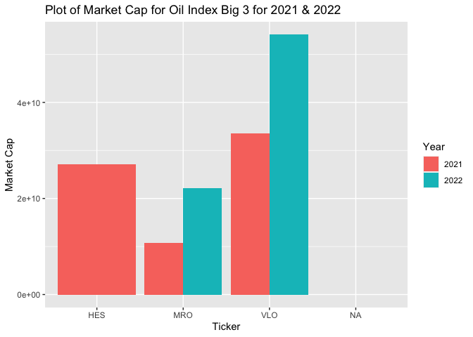

Using APIs: Creating Vignette on Stock Data as Example
================
Evan Brown
2022-06-23

-   [**Required Functions**](#required-functions)
-   [**Functions for API Interaction**](#functions-for-api-interaction)
    -   [‘aggregate’ function](#aggregate-function)
    -   [‘marketcap’ Function](#marketcap-function)
-   [**Data Exploration**](#data-exploration)

This is a vignette to show how to retrieve data from an
[API](https://aws.amazon.com/what-is/api/#:~:text=API%20stands%20for%20Application%20Programming,other%20using%20requests%20and%20responses.).
To demonstrate, I’ll be working with the [Polygon Financial
API](https://polygon.io/docs/stocks/getting-started). For the purposes
of this work, I used a free account with Polygon, limiting my data
retrieval “from-date” to 2 years.

In this vignette, I will work to pull data from the [S&P Oil & Gas
Exploration & Production Industry
Index](https://www.spglobal.com/spdji/en/indices/equity/sp-oil-gas-exploration-production-select-industry-index/#data)
and compare endpoints of some top index constituents to industry
[ETF’s](https://www.investopedia.com/terms/e/etf.asp#:~:text=An%20exchange%2Dtraded%20fund%20(ETF)%20is%20a%20type%20of,that%20a%20regular%20stock%20can.)
and see if I can find any similarities or differences over the past 2
years.

# **Required Functions**

These R packages are required in order to work with the Polygon API:

-   [tidyverse](https://www.tidyverse.org/packages/)  
-   [jsonlite](https://cran.r-project.org/web/packages/jsonlite/index.html)
-   [httr](https://cran.r-project.org/web/packages/httr/vignettes/quickstart.html)

# **Functions for API Interaction**

This portion of the vignette will show where I define functions for
interacting with the Polygon Financial API.

## ‘aggregate’ function

This function returns daily stock endpoints from 06-21-2021 to
06-22-2022 as a tibble for the user provided tibble. apikey default is
my key, but users of the function should pass their own key in the
function call options. User keys can be generated
[here](https://polygon.io/).

``` r
aggregate<- function(ticker, apikey = "OrlbxnjeCyqGDGkKtpIqxKKs0f8Eh77C"){
  
  #Set URL partitions
  baseURL <- "https://api.polygon.io/v2/aggs/ticker/"
    ticker <- ticker
      adjustments <- "/range/1/day/2021-06-22/2022-06-22?adjusted=true&sort=asc&limit=5000&apiKey="
        apikey <- apikey
  
  #Paste partitions to get full URL with desired ticker
  fullURL <- paste0(baseURL, ticker, adjustments, apikey)
  
  #Get api data using get function
  api_data <- GET(fullURL)
    #Convert to character string with fromJSON function
    parsed_api_data <- fromJSON(rawToChar(api_data$content))
      #Save as R object
      parsed_api_data_results <- parsed_api_data$results
        #Convert to tibble
        parsed_tibble <- as_tibble(parsed_api_data_results)

  #Create sequence of raw dates
  dates <- (seq(as.Date("2021-06-22"),as.Date("2022-06-22"),by = 1))
    #Filtering weekends (market not open)
    dates <- as.tibble((dates[!weekdays(dates) %in% c("Saturday","Sunday")]))
      #Filtering holidays (market not open)
        holidaydates <- as.tibble(as.Date(c("2020-01-01", "2020-01-20", "2020-02-17", "2020-04-10", "2020-05-25", "2020-07-03", "2020-09-07",     "2020-11-26", "2020-12-25", "2021-01-01", "2021-01-18", "2021-02-15", "2021-04-02", "2021-05-31", "2021-06-18", "2021-07-05", "2021-09-06", "2021-11-25", "2021-12-24", "2022-01-17", "2022-02-21", "2022-04-15", "2022-05-30", "2022-06-20", "2022-07-04"))) 
          #Removing holiday dates from final dates vector
          finaldates <- anti_join(dates, holidaydates)
            #Combining data and market open dates
            finaldata <- as_tibble(cbind(parsed_tibble, finaldates))
  
  #Change column names
  colnames(finaldata) <- c("volume", "volume_weighted", "open", "close", "high", "low", "Unix_Msec", "transactions", "date")
  
  #Return tibble of data
  return(finaldata)
}
```

## ‘marketcap’ Function

This function returns the [market
cap](https://www.investopedia.com/terms/m/marketcapitalization.asp) for
the user provided ticker and date. apikey default is my key, but users
of the function should pass their own key in the function call options.
User keys can be generated [here](https://polygon.io/).

``` r
marketcap <- function(ticker, date, apikey = "OrlbxnjeCyqGDGkKtpIqxKKs0f8Eh77C"){
  
  #Set URL partitions
  baseURL <- "https://api.polygon.io/v3/reference/tickers/"
    ticker <- ticker
      dateadjustment <- "?date="
        date <- date
          adjustments <- "&apiKey="
            apikey <- apikey
          
  #Paste partitions to get full URL with desired ticker
  fullURL <- paste0(baseURL, ticker, dateadjustment, date, adjustments, apikey)   
  
  #Get api data using get function
  api_data <- GET(fullURL)
    #Convert to character string with fromJSON function
    parsed_api_data <- fromJSON(rawToChar(api_data$content))
      #Save as R object
      parsed_api_data_results <- parsed_api_data$results
        #Save elements of interest
        marketcap <- parsed_api_data_results[["market_cap"]]
        ticker <- parsed_api_data_results[["ticker"]]
        date2 <- date
          #Combine and convert to tibble
          marketcap_data <- as_data_frame(cbind(ticker, marketcap, date))
          
    #Return data
    return(marketcap_data)
}
```

# **Data Exploration**

This portion fo the vignette will now use the function for interacting
with the Polygon Financial API to retrieve some data and look at some of
the endpoints.

The S&P Oil & Gas Exploration & Production Industry Index is comprised
of 61 constituents. Let’s look 3 of the biggest contributors: Valero
Energy Corp (VLO), Marathon Oil Corp (MRO), and Hess Corp (HES). Here,
I’ll work with the marketcap function to retrieve the market cap data
from June 1, 2022 and June 1, 2021, then organize it into a dataset that
we can plot from.

``` r
#Marketcap for VLO
VLOcap_21 <- marketcap("VLO", "2021-06-01")
VLOcap_22 <- marketcap("VLO", "2022-06-01")

#Marketcap for MRO
MROcap_21 <- marketcap("MRO", "2021-06-01")
MROcap_22 <- marketcap("MRO", "2022-06-01")

#Marketcap for HES
HEScap_21 <- marketcap("HES", "2021-06-01")
HEScap_22 <- marketcap("HES", "2022-06-01")

#Create master dataset with marketcaps for all 3 companies in 2021 and 2022
Bigoil_marketcaps <- as_tibble(bind_rows(VLOcap_21, VLOcap_22, MROcap_21, MROcap_22, HEScap_21, HEScap_22))

#Lets change marketcap to a numeric value for better plotting
Bigoil_marketcaps$marketcap <- as.numeric(Bigoil_marketcaps$marketcap)
```

Alright, now let’s plot that data and see what it looks like.

``` r
plot1 <- ggplot(Bigoil_marketcaps, aes(x = ticker, y = marketcap))
plot1 + geom_bar(aes(fill=date), stat = "identity", position = "dodge") +
  labs( x = "Ticker", y = "Market Cap", title = "Plot of Market Cap for Oil Index Big 3 for 2021 & 2022") +
  scale_fill_discrete(name = "Year", labels = c("2021", "2022")) 
```

<!-- -->

Okay, so clearly an increase in market cap for the oil industry “Big 3”
from 2021 to 2022. Since market cap is indicative of the overall value
of the companies, it’s safe to say these guys have done well the past
year.
